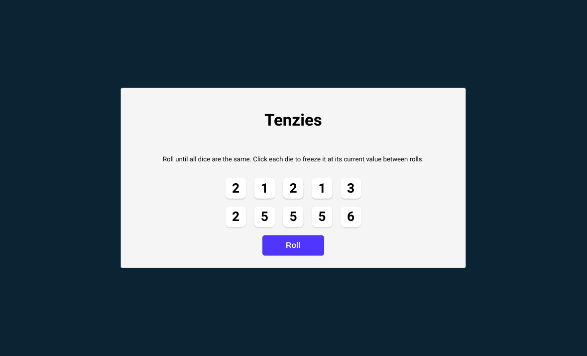
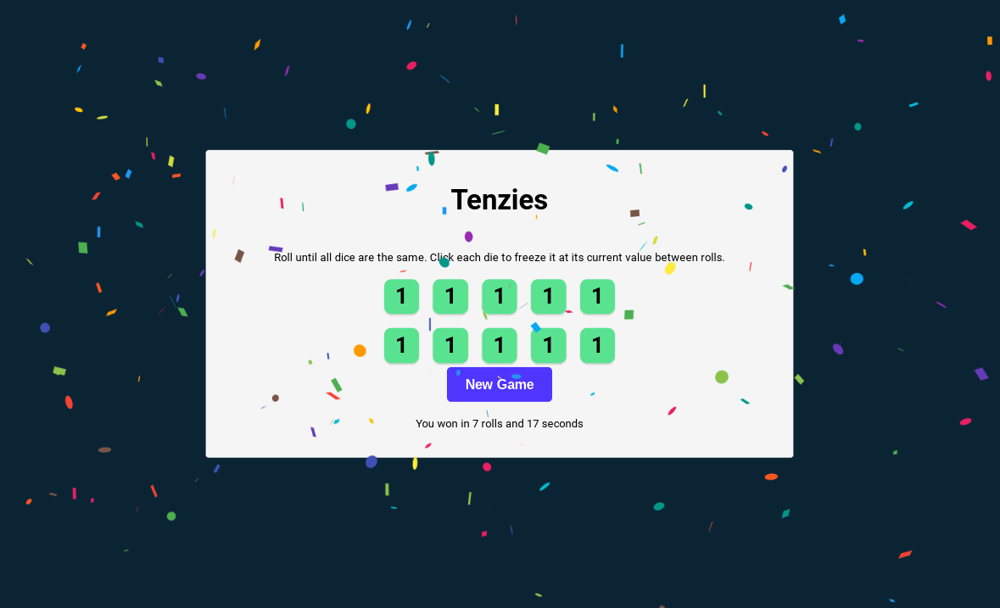

# Scrimba Learn React Course - Section 4: Tenzies Game

[Scrimba](https://scrimba.com/learn/learnreact/tenzies-project-intro-cof0d44bfad1fb88293fdc9d1)

[Live Link](https://jdegand.github.io/tenzies)

## Takeaways

- nanoid is quicker and smaller than uuid
- Lazy state initialization is useful for expensive calculations when setting state for the first time
- JSON.parse(undefined) crashes your program
- Even if useEffect is running almost all the time(like this app), it is better to include the variable in the dependencies array

## Improvements 

- Accessibility considerations

### Resources

- [Stack Overflow](https://stackoverflow.com/questions/5836833/create-an-array-with-random-values) - create array with random values
- [Stack Overflow](https://stackoverflow.com/questions/14832603/check-if-all-values-of-array-are-equal/35568895) - check values of array
- [Blog](https://bobbyhadz.com/blog/javascript-check-if-all-object-values-equal) - check object values
- [NPM](https://www.npmjs.com/package/react-confetti) - React Confetti
- [Stack Overflow](https://stackoverflow.com/questions/21294302/converting-milliseconds-to-minutes-and-seconds-with-javascript) - converting milliseconds
- [Toptal](https://www.toptal.com/software/definitive-guide-to-datetime-manipulation) - datetime manipulation
